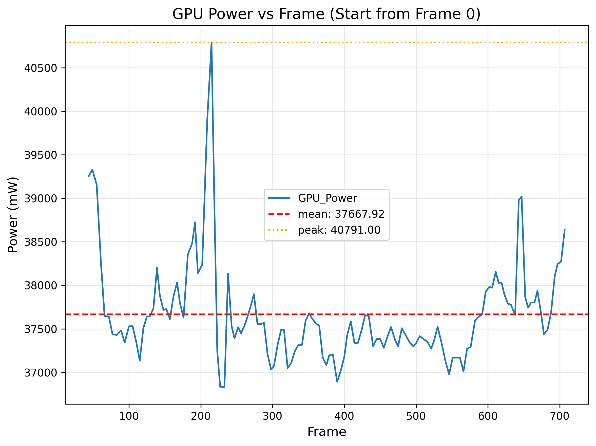
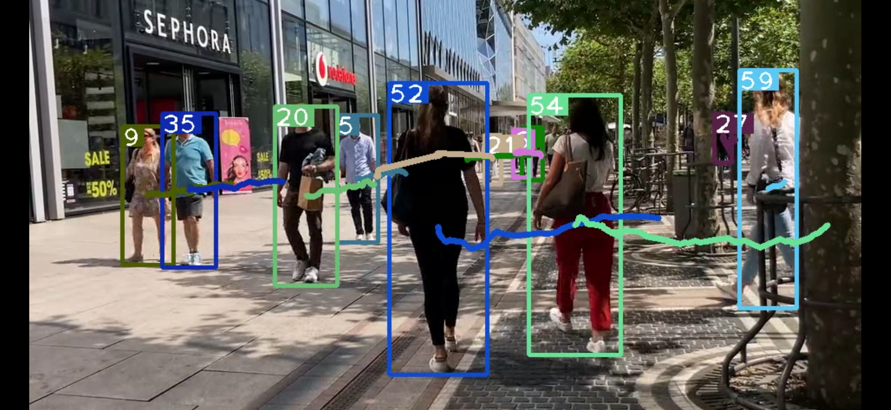

# AS-YOLO: Adaptive Detectors Switching for Power-Efficient Real-Time Object Tracking

# 1. Introduction  
This project proposes a dynamic framework called "AS-YOLO". For resource-constrained edge devices such as drones and mobile robots, this project implements intelligent switching of detectors based on YOLOv5 and DeepSort.
The main goal is to minimize the power consumed by the model by switching between different sized detectors without reducing tracking accuracy.

While completing object tracking and real-time power consumption detection, this solution integrates key motion-related features of the objects themselves with power consumption data to achieve real-time switching of detection models. This approach reduces the device's power consumption while ensuring no impact on tracking accuracy, thereby meeting the corresponding industrial requirements.

### Key Improvements:
* **Adaptive Model Switching:** Dynamically toggles between high-precision and lightweight YOLOv5 models.
* **Enhanced Visualization:** Trajectory colors match their respective bounding boxes; trajectory lines are segmented and automatically hidden when objects disappear.
* **Power-Aware Inference:** Integrates real-time GPU power monitoring to guide detector selection.

---
# 2. Core Methodology

The switching mechanism follows a five-stage pipeline designed for numerical stability, sensitivity to environmental changes, and decision stability.

### （1） Feature Extraction
The switching logic is driven by three key metrics extracted per frame:
1.  **Object Count ($N$):** Reflects the density and perceptual load of the scene.
2.  **Average Acceleration ($A$):** Represents the motion dynamics to determine if high-frequency detection is required.
3.  **Instantaneous Power ($P$):** Real-time energy consumption data obtained via NVIDIA management libraries.

### （2） Information Normalization
To ensure parity across different units of measurement, each metric (Object Count $N$, Acceleration $A$, and Power $P$) is transformed via Min-Max normalization into a dimensionless space $[0, 1]$:

$$V_{norm} = \frac{V_{raw} - V_{min}}{V_{max} - V_{min}}$$

*Boundary constants Vmin and Vmax are derived from empirical profiling of the target hardware.*

### （3） Non-linear Feature Embedding
To prevent the "averaging effect" where critical spikes (e.g., sudden high-speed motion) are diluted, we map normalized metrics into an **Importance Space** using exponential transformations:

$$E_i = (V_{norm, i})^{k_i}$$

We utilize **Sensitivity Coefficients** to bias the system toward specific operational goals:
* **$\alpha$ (Density):** 1.6
* **$\beta$ (Dynamics):** 1.45
* **$\gamma$ (Power):** 1.25

The parameters here can be adjusted appropriately for different environments.

By comparing the power consumption and accuracy of grid search with fixed weights, and considering the points with dynamic weights, we can calculate how many fixed weights are exceeded, and then set a sensitivity index to ensure the model's robustness.

### （4） Dynamic Weight Generation
AS-YOLO employs a self-attention-inspired mechanism to distribute importance dynamically. We utilize a **Softmax-based function** to calculate the optimal weight vector $W$:

$$w_i = \frac{\exp(E_i / T)}{\sum \exp(E_j / T)}$$

* **Temperature Factor ($T$):** Defaulted to 1.0 to control distribution sharpness.
* **Competitive Selection:** When one metric (e.g., motion dynamics) reaches a critical threshold, the Softmax function exponentially suppresses other weights, prioritizing tracking continuity over power saving.

### （5） Composite Scoring & Hysteretic Decision
The final decision score $S$ is the inner product of the dynamic weights and normalized metrics:

$$S = \sum_{i=1}^{3} w_i \cdot V_{norm, i}$$

To prevent **"model flickering"** (rapid oscillation between detectors due to noise), we implement **Hysteretic Decision Logic**:
* A switch is only executed if a target model remains the optimal choice for a consecutive $K$-frame window.
* **Efficiency:** The scores are calculated once every 5 frames, ensuring negligible computational overhead.

### （6） Detectors selection
The system then instantiates the corresponding YOLOv5 variant M∈{s,m,l,x} based on a set of optimized thresholds {T1,T2,T3}:

The detector is selected according to the following rule based on the complexity score:

- YOLOv5s, if (S < T1)
- YOLOv5m, if (T1 S < T2)
- YOLOv5l, if (T_2 < S < T3)
- YOLOv5x, if (S > T3)

The threshold value for T here can also be set according to the environment.

---
# 3. How to implement object tracking and power mapping  
### (1) First, download the code:  
`https://github.com/xiaobaixiaobai233/Yolov5_DeepSort_Track.git`  

The YOLOv5 original pre-trained model `yolov5s.pt` and the pedestrian re-identification model `ckpt.t7` are required; file size limits prevent uploading these files.  

### (2) Set up the virtual environment and configurations according to the process.txt  

### (3) Next, modify parameters in the `track_time_power.py` file:  
Update parameters to your own video file path and YOLOv5 pre-trained model path. Set the encoding format to `mp4v` to ensure saved MP4 files are playable. Run with the following command:  

`python track_time_power.py --source ./group_walk3.mp4 --fourcc mp4v`  

Finally, you can view the object detection and tracking results, with each object’s trajectory line matching its bounding box. Trajectory lines disappear when objects vanish, ensuring clearer visualization of each object’s movement path.  

### (4) Download the corresponding library functions and run the `power_figure.py` file:
The original trace file already used NVIDIA's built-in library functions to extract GPU power consumption intervals and created a `power_trace.csv` file. Now, line charts can be drawn from this file.

---
# 4. Effect Demonstration  
  

# 5. Reference Code Links  
Special thanks to the author of this code:  
[Deepsort tracking algorithm to draw object motion trajectories](https://blog.csdn.net/qq_35832521/article/details/115124521?ops_request_misc=%257B%2522request%255Fid%2522%253A%2522169269914116800222876736%2522%252C%2522scm%2522%253A%252220140713.130102334..%2522%257D&request_id=169269914116800222876736&biz_id=0&utm_medium=distribute.pc_search_result.none-task-blog-2~all~sobaiduend~default-4-115124521-null-null.142%5Ev93%5EchatgptT3_2&utm_term=deepsort%20%E8%BD%A8%E8%BF%B9&spm=1018.2226.3001.4187)
